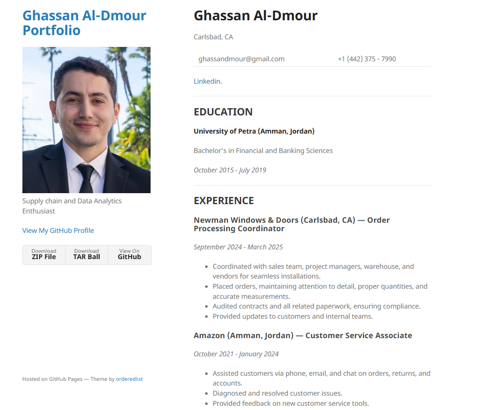

# How I Created My E-Portfolio

## Introduction
This guide explains how I created my personal e-portfolio using GitHub Pages and the Minimal theme.

##  Prerequisites

- A GitHub account
- VSCode installed

## Step 1 — Creating My GitHub Repository
I created a repository named `<myusername>.github.io` on GitHub.  
This name is special because it hosts my personal website automatically.

## Step 2 — Downloading the Minimal Theme
I went to [Minimal Theme](https://github.com/pages-themes/minimal) and clicked **Code → Download ZIP**.

Then I unzipped it and moved all the files into my cloned repository folder on my computer.

I also read the "README" to understand how to use and customize it

## Step 3 — Replacing the Logo and Adding My Info

I replaced the image file logo.png with my own photo in the folder:assets/img/logo.png
Then, I opened index.md and replaced the example text with my own info, like my name, education, and work experience.

## Step 4 — Commit and Push

I saved everything,and pushed from my vscode (source control : commit and push)

## step 5 Step 6 — Viewing My Website

After a few minutes, I went to:
https://ghassandmour.github.io
to see my live website!

Final Result

Here’s a screenshot of my final e-portfolio:

## Editing 
Now after you can see how it looks like you can make any changes you want, 
and once you are done you can commit and push again.
